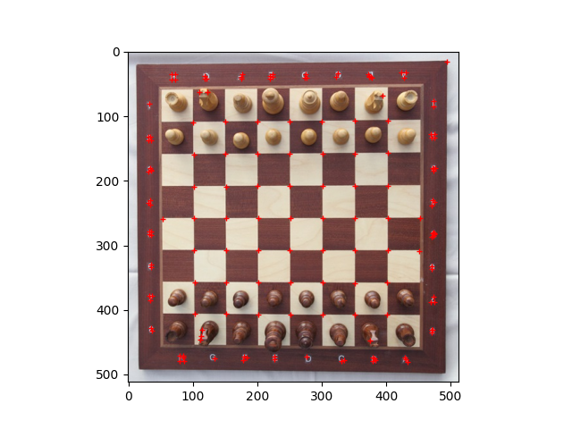

# Harris-Corner-Detector
Python implementation of Harris corner detector, a common corner detection operator in Computer Vision.


## Getting Started
You can clone this repository to your local computer.
```bash
git clone https://github.com/pystander/Harris-Corner-Detector
```

You are suggested to use [pip](https://pypi.org/project/pip/) to install all required packages in [requirements](requirements.txt).
```bash
pip install -r requirements.txt
```


## Usage
Run [detector.py](detector.py) with argument(s) to perform corner detection.
```bash
python detector.py [-h] [-i image_path] [-s sigma] [-k kappa] [-t threshold]
```

### Arguments
| Parameter      | Default               | Description                             |
| -------------- | --------------------- | --------------------------------------- |
| -i --image     |                       | File path of JPEG image to be detected  |
| -s --sigma     | 1.0                   | Standard deviation of Gaussian kernel   |
| -k --kappa     | 0.04                  | Constant in R matrix calculation        |
| -t --threshold | 1e6                   | Threshold of cornerness values          |

### Example
Detect and plot the corners on `images/chessboard.jpg` with default setting.
```bash
python detector.py -i images/chessboard.jpg
```



</br>

Detect and plot the corners on `images/chessboard.jpg` with `kappa` = 0.05 and `threshold` = 2e6.
```bash
python detector.py -i images/chessboard.jpg -k 0.05 -t 2e6
```


## References
- [Chess board with chess set in opening position](https://commons.wikimedia.org/wiki/File:Chess_board_with_chess_set_in_opening_position_IMG_5994.JPG)


## License
Distributed under the GNU GPL-3.0 License. See [LICENSE](LICENSE) for more information.
